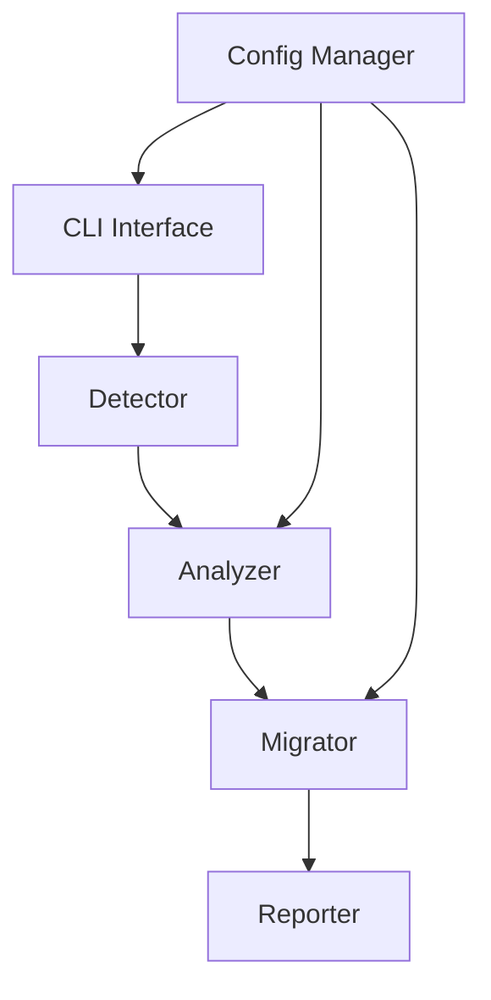

# UniversalLegacyUpdater Architecture and Design

## Overview
UniversalLegacyUpdater is a tool designed for automated migration of legacy codebases to modern versions while preserving 100% of the business logic. It supports legacy languages including PHP 5, VB (Visual Basic), COBOL, old Java versions, and obsolete scripts. Migration targets are:
- PHP 5 → PHP 8
- VB → C#
- COBOL → Java
- Old Java → Latest Java
- Obsolete scripts → Python or Node.js

The system consists of a CLI interface, detection mechanisms, analysis components, migration logic, and a reporting system.

## Supported Languages and Targets
- **PHP 5**: Migrate to PHP 8, updating syntax, deprecated functions, and security improvements.
- **VB (Visual Basic)**: Migrate to C#, converting procedural code to object-oriented, handling COM interop.
- **COBOL**: Migrate to Java, translating procedural logic to object-oriented, preserving data structures.
- **Old Java**: Update to latest Java version, modernizing APIs and syntax.
- **Obsolete Scripts**: Migrate to Python (for data processing) or Node.js (for web scripts), rewriting logic accordingly.

## Technology Stack
- **Core Language**: Python 3.9+ for cross-platform compatibility and extensive libraries.
- **Parsing and AST**: Use language-specific parsers (e.g., php-ast for PHP, ANTLR for COBOL/VB).
- **Code Generation**: Jinja2 templates for generating modern code.
- **CLI Framework**: Click or Typer for command-line interface.
- **Database**: SQLite for storing migration metadata and analysis results.
- **Testing**: Pytest for unit tests, with integration tests for migrations.
- **Containerization**: Docker for isolated execution environments.
- **Version Control Integration**: Git for tracking changes.

## System Architecture

### Modules
1. **CLI Interface**: Entry point for user commands.
2. **Detector**: Identifies legacy code and language types.
3. **Analyzer**: Parses code, extracts business logic, dependencies, and structures.
4. **Migrator**: Applies transformation rules to generate modern code.
5. **Reporter**: Generates reports on migration success, issues, and recommendations.
6. **Config Manager**: Handles configuration files and user preferences.

### Data Flow
```
Input Code → Detector → Analyzer → Migrator → Output Code
                    ↓
                Reporter → Reports
```

Detailed flow:
1. User provides codebase path via CLI.
2. Detector scans files, identifies languages.
3. Analyzer parses each file, builds AST, extracts logic.
4. Migrator applies rules per language to transform code.
5. Reporter compiles results, flags issues.

## CLI Interface
Commands:
- `ulu detect <path>`: Scan and detect legacy code.
- `ulu analyze <path>`: Analyze codebase.
- `ulu migrate <path> --target <lang>`: Perform migration.
- `ulu report <migration_id>`: Generate report.

Options:
- `--dry-run`: Preview changes without applying.
- `--config <file>`: Specify config file.
- `--verbose`: Detailed output.

## Detection Mechanisms
- **File Extension Analysis**: Map extensions (.php, .vb, .cbl, .java, .sh, .bat) to languages.
- **Shebang and Headers**: Check script headers for language indicators.
- **Content Sniffing**: Parse initial lines to confirm language (e.g., PHP opening tag, COBOL IDENTIFICATION).
- **Heuristics**: Use regex for language-specific patterns.

## Analysis Components
- **Parser**: Language-specific AST builders.
- **Logic Extractor**: Identify functions, classes, variables, control flows.
- **Dependency Analyzer**: Map includes, imports, external calls.
- **Business Logic Preservation**: Tag critical logic paths, data flows.
- **Error Handling**: Detect deprecated features, security issues.

## Migration Logic
- **Rule-Based Engine**: Define transformation rules per language pair.
- **Template-Based Generation**: Use templates to output modern code.
- **Incremental Migration**: Allow partial updates, with rollback.
- **Business Logic Verification**: Ensure equivalent behavior via static analysis or tests.
- **Custom Rules**: User-defined rules for specific cases.

## Reporting System
- **Migration Report**: Success rate, changed files, warnings, errors.
- **Analysis Report**: Code metrics, complexity, recommendations.
- **Diff Report**: Before/after code comparisons.
- **JSON/HTML Output**: Structured data for integration.

## Architecture Diagram



This diagram shows the high-level flow from user input through processing to output.